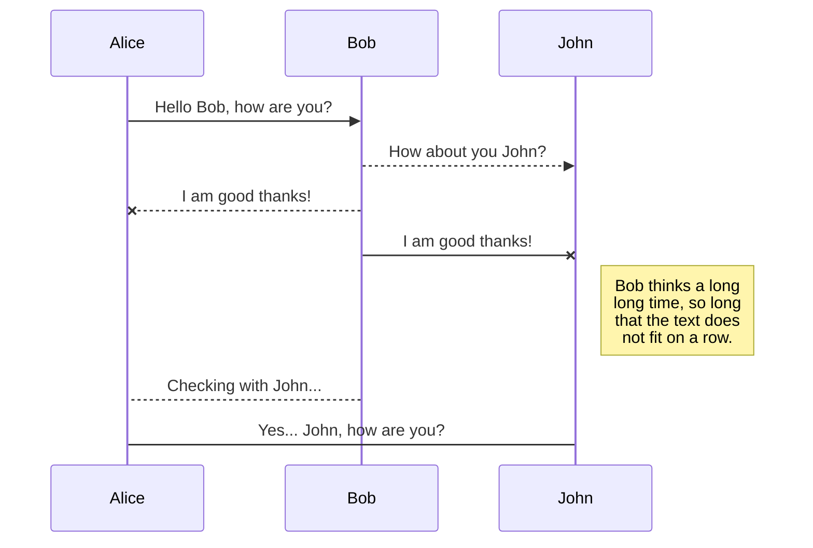
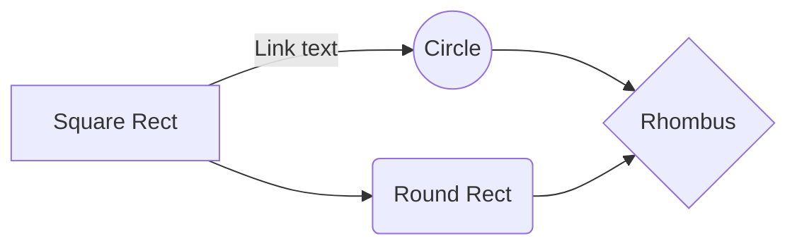

# Bokeh Effect

## Deep Learning Framework for Depth Estimation
We aim to build a robust model that produces bokeh effect from an input image using Deep Learning without using advanced camera lenses or dual lenses. We approach this problem with GANs for depth estimation of input image. We therefore model the Bokeh mode problem to background-foreground seperation (segmentation) problem.
###  NYU Depth Dataset
 For this we used NYU Depth Dataset V2 to train both models. This dataset consists of 1400 images annotated with depth values. We process this depth values to generate depth maps.
  

 ### Pix2Pix
We have trained both Resnet and Unet based Pix2Pix models (but Resnet model is used for final testing). In one step generator is trained twice and discriminator is trained once. It performs very well on NYU Depth Dataset but fails to seperate boundaries for other images (black and white appear in patches). This is possibly because it overfits the dataset (since number of parameters in pix2pix are quite less).
 

 

### Cycle GAN
Cycle-GAN consists of two generators (Resnet Generator) and two discrimantors (Patch-GAN Discriminator). We trained on both 6-block and 9-block generators (9-block generator was found to be better). In one step generator is trained twice and discriminator is trained once. 
Cycle-GAN outperforms Pix2Pix on real world dataset in terms of boundary seperation though it sometimes mis-identifies foreground and background (especially when there is very less color change from background to foreground i.e. low image gradient at the point).
 

 

## Results
|Models                |Abs Rel Error                        |RMS Error                       | 
|----------------|-------------------------------|-----------------------------|
|Pix2Pix|      0.2448       |     2.0075    |    
|Cycle-GAN         |0.3728           |3.1207          |   

## Bokeh from Depth + Input 

After depth estimation is completed we use it to generate bokeh effect on input image. For this we heuristically manipulate Depth data to compensate for errors in it to get a good bokeh effect. We apply disc blurring (averaging pixels over a circle) on the input image and use that image to get the background pixels and use original image to get foreground pixels (boundary between foreground and background is typically set between 100-150 for pixel range 0-255). Now for the model to perform better on human images we use opencv implementation of face detection (using haar features) and penalize the regions containing human images to bring them to foreground and prevent them from blurring (in case the model wrongly predicts human faces).

## References

--> https://neurohive.io/en/popular-networks/pix2pix-image-to-image-translation/
--> https://cs.nyu.edu/~silberman/datasets/nyu_depth_v2.html

## Rename a file

You can rename the current file by clicking the file name in the navigation bar or by clicking the **Rename** button in the file explorer.

## Delete a file

You can delete the current file by clicking the **Remove** button in the file explorer. The file will be moved into the **Trash** folder and automatically deleted after 7 days of inactivity.

## Export a file

You can export the current file by clicking **Export to disk** in the menu. You can choose to export the file as plain Markdown, as HTML using a Handlebars template or as a PDF.

# Synchronization

Synchronization is one of the biggest features of StackEdit. It enables you to synchronize any file in your workspace with other files stored in your **Google Drive**, your **Dropbox** and your **GitHub** accounts. This allows you to keep writing on other devices, collaborate with people you share the file with, integrate easily into your workflow... The synchronization mechanism takes place every minute in the background, downloading, merging, and uploading file modifications.

There are two types of synchronization and they can complement each other:

- The workspace synchronization will sync all your files, folders and settings automatically. This will allow you to fetch your workspace on any other device.
	> To start syncing your workspace, just sign in with Google in the menu.

- The file synchronization will keep one file of the workspace synced with one or multiple files in **Google Drive**, **Dropbox** or **GitHub**.
	> Before starting to sync files, you must link an account in the **Synchronize** sub-menu.

## Open a file

You can open a file from **Google Drive**, **Dropbox** or **GitHub** by opening the **Synchronize** sub-menu and clicking **Open from**. Once opened in the workspace, any modification in the file will be automatically synced.

## Save a file

You can save any file of the workspace to **Google Drive**, **Dropbox** or **GitHub** by opening the **Synchronize** sub-menu and clicking **Save on**. Even if a file in the workspace is already synced, you can save it to another location. StackEdit can sync one file with multiple locations and accounts.

## Synchronize a file

Once your file is linked to a synchronized location, StackEdit will periodically synchronize it by downloading/uploading any modification. A merge will be performed if necessary and conflicts will be resolved.

If you just have modified your file and you want to force syncing, click the **Synchronize now** button in the navigation bar.

> **Note:** The **Synchronize now** button is disabled if you have no file to synchronize.

## Manage file synchronization

Since one file can be synced with multiple locations, you can list and manage synchronized locations by clicking **File synchronization** in the **Synchronize** sub-menu. This allows you to list and remove synchronized locations that are linked to your file.

# Publication

Publishing in StackEdit makes it simple for you to publish online your files. Once you're happy with a file, you can publish it to different hosting platforms like **Blogger**, **Dropbox**, **Gist**, **GitHub**, **Google Drive**, **WordPress** and **Zendesk**. With [Handlebars templates](http://handlebarsjs.com/), you have full control over what you export.

> Before starting to publish, you must link an account in the **Publish** sub-menu.

## Publish a File

You can publish your file by opening the **Publish** sub-menu and by clicking **Publish to**. For some locations, you can choose between the following formats:

- Markdown: publish the Markdown text on a website that can interpret it (**GitHub** for instance),
- HTML: publish the file converted to HTML via a Handlebars template (on a blog for example).

## Update a publication

After publishing, StackEdit keeps your file linked to that publication which makes it easy for you to re-publish it. Once you have modified your file and you want to update your publication, click on the **Publish now** button in the navigation bar.

> **Note:** The **Publish now** button is disabled if your file has not been published yet.

## Manage file publication

Since one file can be published to multiple locations, you can list and manage publish locations by clicking **File publication** in the **Publish** sub-menu. This allows you to list and remove publication locations that are linked to your file.

# Markdown extensions

StackEdit extends the standard Markdown syntax by adding extra **Markdown extensions**, providing you with some nice features.

> **ProTip:** You can disable any **Markdown extension** in the **File properties** dialog.

## SmartyPants

SmartyPants converts ASCII punctuation characters into "smart" typographic punctuation HTML entities. For example:

|                |ASCII                          |HTML                         |
|----------------|-------------------------------|-----------------------------|
|Single backticks|`'Isn't this fun?'`            |'Isn't this fun?'            |
|Quotes          |`"Isn't this fun?"`            |"Isn't this fun?"            |
|Dashes          |`-- is en-dash, --- is em-dash`|-- is en-dash, --- is em-dash|

## KaTeX

You can render LaTeX mathematical expressions using [KaTeX](https://khan.github.io/KaTeX/):

The *Gamma function* satisfying $\Gamma(n) = (n-1)!\quad\forall n\in\mathbb N$ is via the Euler integral

$$
\Gamma(z) = \int_0^\infty t^{z-1}e^{-t}dt\,.
$$

> You can find more information about **LaTeX** mathematical expressions [here](http://meta.math.stackexchange.com/questions/5020/mathjax-basic-tutorial-and-quick-reference).

## UML diagrams

You can render UML diagrams using [Mermaid](https://mermaidjs.github.io/). For example, this will produce a sequence diagram:

And this will produce a flow chart:

