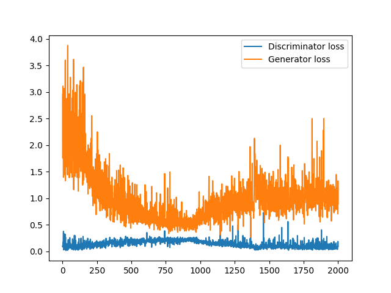

# Bokeh Effect

## Deep Learning Framework for Depth Estimation
We aim to build a robust model that produces bokeh effect from an input image using Deep Learning without using advanced camera lenses or dual lenses. We approach this problem with GANs for depth estimation of input image. We therefore model the Bokeh mode problem to background-foreground seperation (segmentation) problem.
###  NYU Depth Dataset
 For this we used NYU Depth Dataset V2 to train both models. This dataset consists of 1400 images annotated with depth values. We process this depth values to generate depth maps.
  

 ### Pix2Pix
We have trained both Resnet and Unet based Pix2Pix models (but Resnet model is used for final testing). In one step generator is trained twice and discriminator is trained once. It performs very well on NYU Depth Dataset but fails to seperate boundaries for other images (black and white appear in patches). This is possibly because it overfits the dataset (since number of parameters in pix2pix are quite less).
 

* Model Architecture

 

* Model Results

  
  

### Cycle GAN
Cycle-GAN consists of two generators (Resnet Generator) and two discrimantors (Patch-GAN Discriminator). We trained on both 6-block and 9-block generators (9-block generator was found to be better). In one step generator is trained twice and discriminator is trained once. 
Cycle-GAN outperforms Pix2Pix on real world dataset in terms of boundary seperation though it sometimes mis-identifies foreground and background (especially when there is very less color change from background to foreground i.e. low image gradient at the point).
 

* Model Architecture

 

* Model losses 

  

 
 * Model Results

  
  

## Results
|Models                |Abs Rel Error                        |RMS Error                       | 
|----------------|-------------------------------|-----------------------------|
|Pix2Pix|      0.2448       |     2.0075    |    
|Cycle-GAN         |0.3728           |3.1207          |   

<b> Here are some of the loss graphs for our models. </b>

<i> Pix2Pix (using Resnet-9 Generator) </i>

  

 
<i> CycleGAN (also using Resnet-9 Generator) </i>

  

## Bokeh from Depth + Input 

After depth estimation is completed we use it to generate bokeh effect on input image. For this we heuristically manipulate Depth data to compensate for errors in it to get a good bokeh effect. We apply disc blurring (averaging pixels over a circle) on the input image and use that image to get the background pixels and use original image to get foreground pixels (boundary between foreground and background is typically set between 100-150 for pixel range 0-255). Now for the model to perform better on human images we use opencv implementation of face detection (using haar features) and penalize the regions containing human images to bring them to foreground and prevent them from blurring (in case the model wrongly predicts human faces).

### Bokeh Testing from Human Images

Even though our model was not trained on the images of humans, it still manages to find the boundaries and detect foreground and background in some cases 

* DepthMap Generated

  
  

 

* Bokeh generated

  

## Requirements

Kindly run the requirements.txt to install all the required libraries for replicating this project.

## Running the code

<i> For training the models from scratch </i>

Run`bash get_dataset.sh` in order to download the NYUv-2 dataset and save it as .png images
 
Then run `bash make_folders.sh` to create the required directorie
 
After that run `python3 src/train.py <'CycleGAN/P2P'> [<finesize> <loadsize>]` for training the CycleGAN or Pix2Pix model (The results will be visible in the   results   folder)

</ul>

<i> Finding the Bokeh-Image from the given Image </i>
 
 Run `python3 src/bokehEffect.py <modelName> <modelType(p/c)> <ImagePath>` to get the resultant Bokeh Image (bokeh.jpg)
 
<i> Finding the Depthmap for the given RGB  image </i>
 
Run `python3 src/testModel.py <modelName> <ImagePath> <modelType(p/c)>` to get the resultant depthMap (testOutput.jpeg)

## References

--> https://neurohive.io/en/popular-networks/pix2pix-image-to-image-translation/  
--> https://cs.nyu.edu/~silberman/datasets/nyu_depth_v2.html

